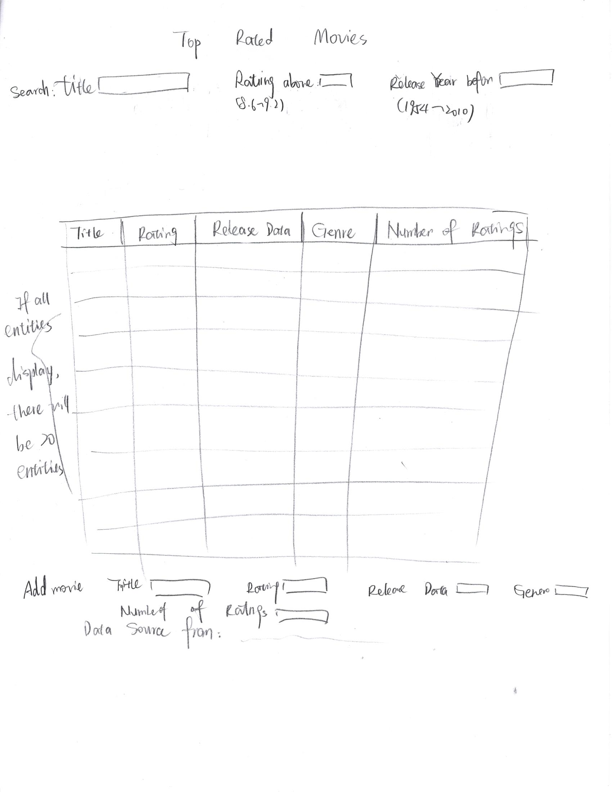
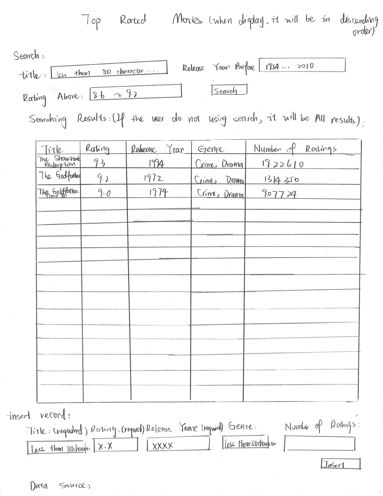

# Project 2, Milestone 1 - Design & Plan

Your Name: Jiamin Zeng

## 1. Persona

I've selected **[Abby]** as my persona.

I've selected my persona because Abby is a accountant and comfortable with what she uses regularly. For this project, we need to render a database on a web page, which is common in daily life. Also, as Abby enjoys math and logic, which is suitable as a client, for the reason that I can get valuable feedback whether the database is present in a logic order.

## 2.Describe your Catalog

[What will your collection be about? What types of attributes (database columns) will you keep track of for the *things* in your collection? 1-2 sentences.]

The collection I chose is the top rated movies from the IMDb. Each entity will have 5 attributes: title, rating, release year, genre, number of ratings.

## 3. Sketch & Wireframe

[Insert your 1 sketch here.]

[Insert your 1 wireframe here.]

[Explain why your design would be effective for your persona. 1-3 sentences.]

My design mainly focus on the display of database, and there is about rating, which is related to statistic. I believe it fits Abby's interest. Also, the search form I implement on the top is logic as it would not lead to no search result if the user follow the instruction, which also suitable for Abby's personality. However, for the text search bar, it may lead to no result.
## 4. Database Schema Design

[Describe the structure of your database. You may use words or a picture. A bulleted list is probably the simplest way to do this.]

Table: top_rated_movies
* field 1: title: Not Null, Text
* field 2: rating: Not Null, Real
* field 3: release_year: Not Null, Integer
* field 4: genre: Text
* field 5: number_of_ratings: Integer
* field 6: movie_id: Not Null, Integer, Primary Key, Unique, AI

## 5. Database Query Plan

[Plan your database queries. You may use natural language, pseudocode, or SQL.]

1. All records

```sql
SELECT * FROM top_rated_movies;
```

2. Search records by user selected field

```sql
SELECT * FROM top_rated_movies WHERE rating > :ranting;

SELECT * FROM top_rated_movies WHERE release_year < :year;
```

3. Insert record

```sql
INSERT INTO top_rated_movies
VALUES (:$insert_title, :$insert_rating, :$insert_release_year, :$insert_genre, :$inset_number_of_ratings);
```

## 6. *Filter Input, Escape Output* Plan

[Describe your plan for filtering the input from your HTML forms. Describe your plan for escaping any values that you use in HTML or SQL. You may use natural language and/or pseudocode.]
For the input, I will restrict the size of input to be 80 characters, as the data I used has a title length less than 80, if the input does not fit the restriction, it would not return the result. For the genre, it is restricted to be less than 50 characters.
After got the valid result, firstly, I will filter the input and delete all the trim and turn the input to lower case. Using a for loop to search whether there is a records match the input.(The input do not need to care about the space, case sensitive and whether entering a full name of the movie)
## 7. Additional Code Planning

[If you need more code planning that didn't fit into the above sections, put it here.]
