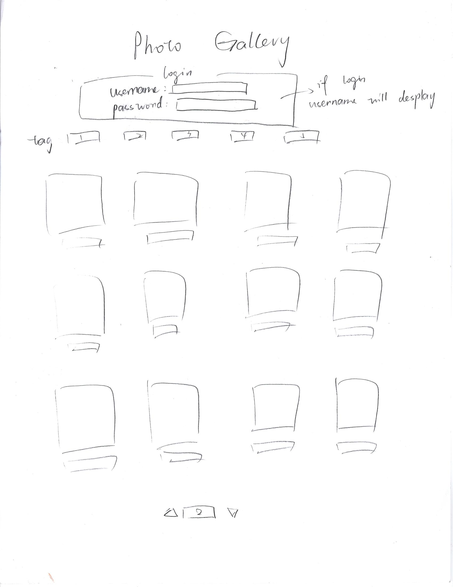
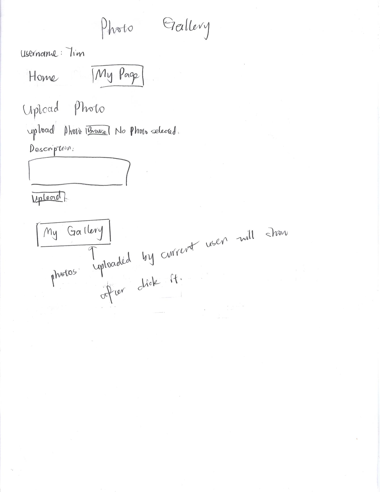
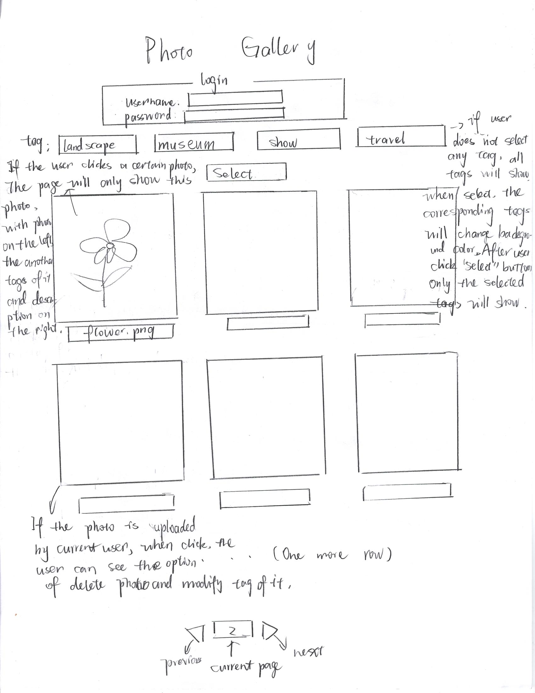
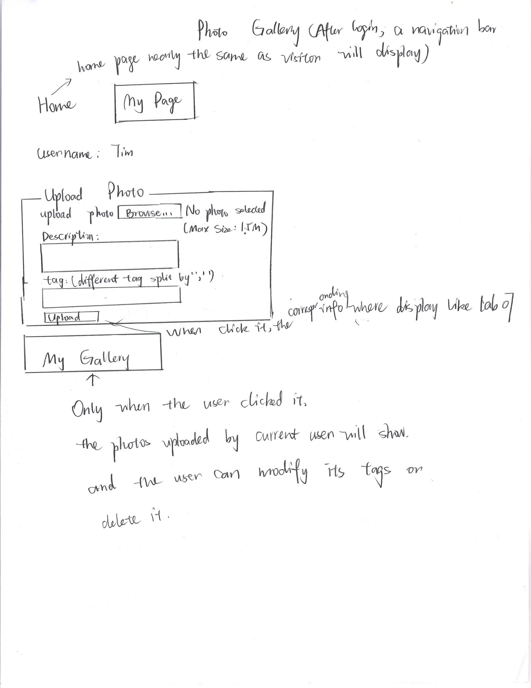

# Project 3 - Design & Plan

Your Name: Jiamin Zeng

## 1. Persona

I've selected **[Tim]** as my persona.

I've selected my persona because Tim prefers something new and softwares in latest version. I am going to implement some new features in my photo gallery which will get better feedbacks if I choose him. Also, as he prefers to response the email as soon as he receives it, and my gallery needs to response in real time, I think he is a good tester for this function.

## 2. Sketches & Wireframes

### Sketches

[Insert your sketches here.]



### Wirefames

[Insert your wireframes here.]



[Explain why your design would be effective for your persona. 1-3 sentences.]
For the user who logs in, his own page is somehow unique, and the function is not uniform, for person like Tim may like this fancy design. Also, as the response of user action is in real time, which fits Tim's habit.

## 3. Database Schema Plan

[Describe the structure of your database. You may use words or a picture. A bulleted list is probably the simplest way to do this.]

Table: photos
* id: INTEGER, NOT NULL, PRIMARY KEY,      AUTOINCREMENT, UNIQUE
* photo_name: TEXT, NOT NULL
* ext: TEXT, NOT NULL
* description: TEXT
* author_id: INTEGER, NOT NULL, FOREIGN KEY REFER id in users table

Table: users
* id: INTEGER, NOT NULL, PRIMARY KEY,      AUTOINCREMENT, UNIQUE
* username: TEXT, NOT NULL
* password: TEXT, NOT NULL
* session: TEXT, UNIQUE

Table: tags
* id: INTEGER, NOT NULL, PRIMARY KEY,      AUTOINCREMENT, UNIQUE
* tag_name: TEXT, NOT NULL, UNIQUE
* author_id: INTEGER, NOT NULL, FOREIGN KEY
REFER id in user table

Table: tag_photo
* id: INTEGER, NOT NULL, PRIMARY KEY,      AUTOINCREMENT, UNIQUE
* photo_id: INTEGER, NOT NULL, FOREIGN KEY REFER id in photos table
* tag_id: INTEGER, NOT NULL, FOREIGN KEY REGER id in tags table

## 4. Database Query Plan

[Plan your database queries. You may use natural language, pseudocode, or SQL.]
For insert:
Insert photo info of its name, extension, current user id and description in photos table.

For add tag:
There will be a data list show exist tag in the database that current image does not have, and an option for "other" to let user add new tag. If the user choose a tag in the database, just update the tag_photo table, if not, add new tag in the tags table first, then update the tag_photo table.

For Photo Delete:
Delete photo in photos table and update the tag_photo table.

For Tags Delete:
The user can only delete the tag this image has. There is a data list show the tags that current image has for the user to choose from. When user click the delete button, update the tag_photo table.
## 5. Structure and Pseudocode

### Structure

[List the PHP files you will have. You will probably want to do this with a bulleted list.]

* index.php - main page.
* includes/init.php - stuff that useful for every web page.
* includes/header.php - navigation bar, only show for login user
* mypage.php - the personal page for current user.
* image.php - show single image when the user click a specific image

### Pseudocode

[For each PHP file, plan out your pseudocode. You probably want a subheading for each file.]

#### index.php

```
Pseudocode for index.php...

include init.php
form for Login (if login, username and navigation bar will show on the screen)
Also, a logout button will show 
search bar function
For user who login, a navigation bar will show to let him turn to his own page.
```

#### includes/init.php

```
messages = array to store messages for user (you may remove this)

// DB helper functions (you do not need to write this out since they are provided.)

db = connect to db

filter input, if valid, execute the sql statement. If the fetch result is valid,
escape output and return it. If not, store the error message and print it on the screen.

```

#### includes/mypage.php

```
include init.php
Add the form to let user upload photo.
When the user submit the upload request, filter the input and check the form of input file, if the file does not have a extension of image, return error message.
If the file is valid, store the information in corresponding table and return a message to told user the file is uploaded successfully.
Let the user to modify his own photo, when the user modify the tag or the photo, filter the input, if valid, update the corresponding tables and return the messages.
Images uploaded by current user will show.

```
#### includes/image.php

```
include init.php
When the user click an image, this page will show. It is used to display single image. As both visitors and users can use this function, it only allows the user turn to the home page.
For login user, navigation bar will show on the screen. If the current image is uploaded by current user, the user can choose to delete the photo, add tag and delete tag.

```

## 6. Seed Data - Username & Passwords

[List the usernames and passwords for your users]

* user1 : tim info2300
* user2 : abby nba5301
